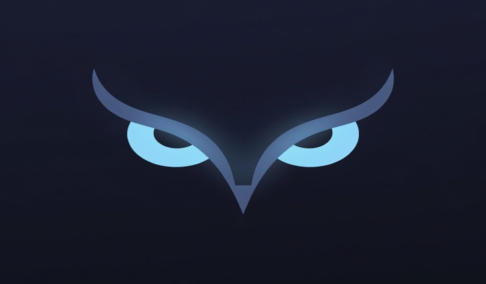

<h1 align="center">
   
  ⚔️ NIGHTWATCH
</h1>

  <b>Albion Online — Advanced Network-Based Radar & Overlay</b> 
  <i>Ağ tabanlı gelişmiş radar ve overlay sistemi</i>

  
  
  
  
  

  <a href="https://jung1330.github.io/Nightwatch-Radar/">🌐 Website</a> &nbsp;|&nbsp;
  <a href="#-kurulum--installation">📦 Kurulum / Install</a> &nbsp;|&nbsp;
  <a href="#-roadmap">🚀 Roadmap</a> &nbsp;|&nbsp;
  <a href="#-iletişim--contact">📞 İletişim / Contact</a>

 

 

---

## 📌 Nedir? / What is it?

<table width="100%">
<tr>
<td width="50%" valign="top">

**🇹🇷 Türkçe**

**Nightwatch**, Albion Online için geliştirilmiş, oyunun belleğine (RAM) veya dosyalarına **hiçbir müdahalede bulunmadan** yalnızca ağ paketlerini okuyarak çalışan gelişmiş bir radar ve overlay uygulamasıdır.

- ✅ Bellek okuma / kod enjeksiyonu yok
- ✅ FPS kaybı yok — arka planda sessizce çalışır
- ✅ VPN ve oyun hızlandırıcı desteği
- ✅ 4 dil desteği (TR / EN / RU / ZH)

</td>
<td width="50%" valign="top">

**🇬🇧 English**

**Nightwatch** is an advanced radar and overlay application for Albion Online that works by **reading only network packets** without interfering with the game's memory (RAM) or files.

- ✅ No memory reading / no code injection
- ✅ Zero FPS impact — runs silently in background
- ✅ VPN and game accelerator support
- ✅ 4 language support (TR / EN / RU / ZH)

</td>
</tr>
</table>

---

## ✨ Özellikler / Features

<table width="100%">
<tr>
<td width="50%" valign="top">

### 🇹🇷 Özellikler

**🛡️ Gelişmiş Oyuncu Takibi (ESP)**
Yakındaki oyuncuların HP'si, gerçek ortalama IP'si ve tam ekipman listesi anlık olarak gösterilir.

**🃏 Detaylı Ekipman Kartları** *(Yeni)*
En tehlikeli 5 düşmanın ekipmanlarını orijinal ikonlarıyla kart olarak görün. Hafıza sistemi sayesinde kısa süreliğine ayrılan düşmanlar da takip edilir.

**💎 Kaynak Takibi**
Tier ve Büyü (Enchant) seviyelerine göre gelişmiş filtreleme. Orijinal oyun ikonları ve doluluk çubukları.

**🗺️ Harita Arkaplanı**
Gerçek Albion haritaları radar üzerinde dinamik olarak gösterilir. Şeffaflık ve ölçek ayarları tam kontrol sağlar.

**🎯 Lazer Tracker Sistemi**
Takip listenizdeki mob ve kaynakları ekranda lazer çizgisiyle işaretleyin. Özelleştirilebilir renk ve kalibrasyon.

**🌐 VPN & Adaptör Desteği**
Device sekmesindeki Tanılama Aracı ile hangi ağ kartının Albion trafiği aldığını otomatik tespit edin.

**📺 OBS Bypass (Streamer Modu)**
Yayın yaparken radarın OBS tarafından görünmesini engelleyen yerleşik Stream Modu.

**⚙️ Config & Profil Sistemi**
Birden fazla profil kaydedin. Autoconfig.txt ile açılışta otomatik yükleme.

**🔬 DevTools & Parser**
Ham ağ paketi analizi, mob simülatörü, oyuncu decode araçları ve UDP port tarayıcısı.

</td>
<td width="50%" valign="top">

### 🇬🇧 Features

**🛡️ Advanced Player Tracking (ESP)**
Nearby players' HP, True Average IP, and Full Equipment List displayed in real-time.

**🃏 Detailed Equipment Cards** *(New)*
See up to 5 enemies' equipment with original icons as cards on screen. Memory system keeps tracking briefly absent enemies.

**💎 Resource Tracking**
Advanced filtering by Tier and Enchantment level. Original game icons with fill bars.

**🗺️ Map Background**
Real Albion maps displayed dynamically on the radar with opacity and scale controls.

**🎯 Laser Tracker System**
Mark tracked mobs and resources with laser lines on screen. Customizable color and calibration.

**🌐 VPN & Adapter Support**
Network Diagnostic Tool in the Device tab auto-detects which adapter is receiving Albion traffic.

**📺 OBS Bypass (Streamer Mode)**
Built-in Stream Mode that hides the radar from OBS and screen recording software.

**⚙️ Config & Profile System**
Save multiple profiles for different scenarios. Auto-load via Autoconfig.txt on startup.

**🔬 DevTools & Parser**
Raw network packet analysis, mob simulator, player decode tools and UDP port scanner.

</td>
</tr>
</table>

---

## 📦 Kurulum / Installation

> ⚠️ **Gereksinim / Requirement:** [Npcap](https://npcap.com/#download) sürücüsü kurulu olmalıdır / Npcap driver must be installed.

<table width="100%">
<tr>
<td width="50%" valign="top">

**🇹🇷 Kurulum Adımları**

1. **[Npcap](https://npcap.com/#download)** sürücüsünü indirin ve kurun
2. **Nightwatch.exe** dosyasını **Yönetici Olarak** çalıştırın
3. **Device** sekmesinden aktif ağ kartınızı (veya VPN adaptörünüzü) seçin
4. Programı yeniden başlatın — radar otomatik başlayacaktır

> 💡 **İpucu:** VPN veya hızlandırıcı kullanıyorsanız, Device sekmesindeki **"Ağları Test Et"** butonuna basarak doğru adaptörü otomatik tespit edebilirsiniz.

</td>
<td width="50%" valign="top">

**🇬🇧 Installation Steps**

1. Download and install **[Npcap](https://npcap.com/#download)** driver
2. Run **Nightwatch.exe** as **Administrator**
3. Select your active network card (or VPN adapter) from the **Device** tab
4. Restart the program — radar will start automatically

> 💡 **Tip:** If using VPN or accelerator, click **"Test Networks"** in the Device tab to automatically detect which adapter is receiving Albion traffic.

</td>
</tr>
</table>

---

## 🚀 Roadmap

<table width="100%">
<tr>
<td width="50%" valign="top">

**🇹🇷 Yapılacaklar**

- [ ] Kullanıcı HP gösterimi düzeltmesi
- [ ] Stabilite iyileştirmeleri

**✅ Tamamlananlar**
- [x] Ekipman Kartları sistemi
- [x] Tehlike Pusulası
- [x] Hareket İzi & Waypoint
- [x] OBS Bypass (Streamer Modu)
- [x] VPN & Adaptör Tanılama Aracı
- [x] Lazer Tracker Sistemi
- [x] Harita arkaplanı
- [x] 4 dil desteği (TR/EN/RU/ZH)
- [x] UDP Port Tarayıcısı
- [x] DevTools & Parser

</td>
<td width="50%" valign="top">

**🇬🇧 To-Do**

- [ ] User HP display fix
- [ ] Stability fixes

**✅ Completed**
- [x] Equipment Cards system
- [x] Danger Compass
- [x] Player Trails & Waypoint
- [x] OBS Bypass (Streamer Mode)
- [x] VPN & Adapter Diagnostic Tool
- [x] Laser Tracker System
- [x] Map background
- [x] 4 language support (TR/EN/RU/ZH)
- [x] UDP Port Scanner
- [x] DevTools & Parser

</td>
</tr>
</table>

---

## 🖥️ Sistem Gereksinimleri / System Requirements

| | Minimum |
|---|---|
| **OS** | Windows 10 / 11 x64 |
| **Runtime** | .NET 8.0 |
| **Driver** | [Npcap](https://npcap.com/#download) |
| **Privileges** | Administrator (Yönetici) |

---

## 📞 İletişim / Contact

<table width="100%">
<tr>
<td width="50%" valign="top">

**🇹🇷**

- **Discord:** `Jung1330`
- **Website:** [jung1330.github.io/Nightwatch-Radar](https://jung1330.github.io/Nightwatch-Radar/)
- Her oyun güncellemesinde yeni sürüm yayınlanacaktır.

</td>
<td width="50%" valign="top">

**🇬🇧**

- **Discord:** `Jung1330`
- **Website:** [jung1330.github.io/Nightwatch-Radar](https://jung1330.github.io/Nightwatch-Radar/)
- A new version will be released with every game update.

</td>
</tr>
</table>

---

  © 2026 Jung1330 — MIT License &nbsp;|&nbsp; Nightwatch is not affiliated with Albion Online or Sandbox Interactive.

