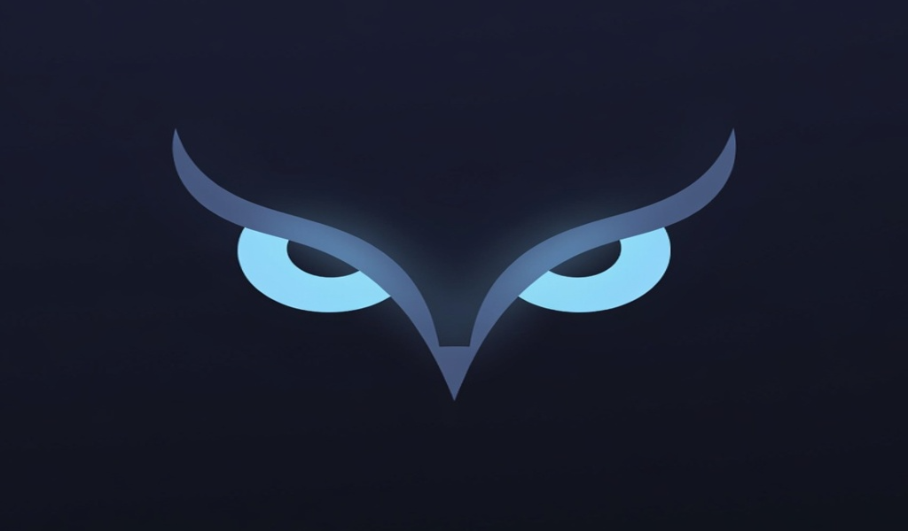

  

<h1 align="center">🌙 Nightwatch Radar</h1>

  
  
  
  
  

---

<table>

 

 

<tr>
<td width="50%" valign="top">

## 🇹🇷 Hakkında

**Nightwatch**, Albion Online için geliştirilmiş gerçek zamanlı bir radar ve overlay aracıdır. Oyun penceresinin üzerine şeffaf bir katman olarak yerleşir ve ağ trafiğini analiz ederek oyuncuları, mob'ları, kaynakları ve mist portallarını harita üzerinde gösterir.

</td>
<td width="50%" valign="top">

## 🇬🇧 About

**Nightwatch** is a real-time radar and overlay tool designed for Albion Online. It sits as a transparent layer on top of the game window and analyzes network traffic to display players, mobs, resources, and mist portals on the map.

</td>
</tr>
</table>

---

<table>
<tr>
<td width="50%" valign="top">

## ✨ Özellikler

### 🗺️ Radar & Minimap
- Oyun haritasıyla senkronize gerçek zamanlı minimap
- 50m / 100m / 150m mesafe halkaları
- Aktif algılama menzili çemberi
- Waypoint (işaret koyma) sistemi
- Özelleştirilebilir zoom ve kalibrasyon

### 👥 Oyuncu Takibi
- Diğer oyuncuların gerçek zamanlı konumları
- İsim ve guild gösterimi
- Hareket izi (trail) çizgileri
- Yaklaşan düşman sesli alarm
- Anlık düşman sayacı (watermark)
- Whitelist (arkadaş listesi) desteği
- Ekipman kartları (Albion Render API)

### 🐉 Mob Sistemi
- Tüm düşman mob'ları radarda gösterme
- Boss & Aspect mobları taç ikonu ile vurgulama
- ID/isim bazlı mob veritabanı tarayıcı
- Blacklist — İstenmeyen mob'ları gizleme
- Crown sistemi — Özel mob'lara taç atama
- Crystal Spider, Fairy Dragon, Griffin, Veil Weaver özel ikonları

### ⛏️ Kaynak Takibi
- Ore, Stone, Fiber, Hide, Logs tam destek
- T1-T8 ve Enchant 0-4 matris filtreleme
- Canlı kaynaklar (Elemental, Geyik vb.) algılama
- Tier/enchant'a özel PNG ikonlar
- Tracker Only modu

### 🌫️ Mist & Portal
- Common → Legendary rarity renkleriyle mist gösterimi
- Duo Mist desteği
- Hidden Chest (gizli sandık) algılama

### 🎯 Tracker Lazer Sistemi
- Kaynaklara, VIP mob'lara ve normal mob'lara lazer
- Scale X/Y, açı ve uç noktası kalibrasyonu
- Mob ve kaynak lazerleri için ayrı renk seçimi

### ⚙️ Gelişmiş Ayarlar
- JSON profil kaydetme/yükleme
- Otomatik config yükleme (Autoconfig)
- Özelleştirilebilir kısayol tuşları
- System tray (görev çubuğu) desteği
- OBS Bypass / Streamer Modu (Win11)
- DPI-Aware — Yüksek çözünürlük desteği
- Tema seçimi (Obsidian Blue / Original)

### 🛠️ Geliştirici Araçları
- Mob ve kaynak simülatörü
- Mob veritabanı tarayıcı
- Ham paket parser ve karşılaştırma
- Pointer scanner
- Renkli UI konsol ve log dışa aktarma

</td>
<td width="50%" valign="top">

## ✨ Features

### 🗺️ Radar & Minimap
- Real-time minimap synchronized with the game map
- 50m / 100m / 150m distance rings
- Active sniff range indicator
- Waypoint (map marker) system
- Customizable zoom and calibration

### 👥 Player Tracking
- Real-time positions of other players
- Name and guild display
- Movement trail lines
- Approaching enemy sound alarm
- Live enemy counter (watermark)
- Whitelist (friends list) support
- Equipment cards (Albion Render API)

### 🐉 Mob System
- Display all enemy mobs on radar
- Boss & Aspect mobs highlighted with crown icon
- ID/name-based mob database browser
- Blacklist — Hide unwanted mobs
- Crown system — Assign crown icons to specific mobs
- Crystal Spider, Fairy Dragon, Griffin, Veil Weaver special icons

### ⛏️ Resource Tracking
- Full support for Ore, Stone, Fiber, Hide, Logs
- T1-T8 and Enchant 0-4 matrix filtering
- Living resources (Elemental, Deer, etc.) detection
- Tier/enchant-specific PNG icons
- Tracker Only mode

### 🌫️ Mist & Portal
- Mist display with Common → Legendary rarity colors
- Duo Mist support
- Hidden Chest detection

### 🎯 Tracker Laser System
- Lasers pointing to resources, VIP mobs, and normal mobs
- Scale X/Y, angle, and endpoint calibration
- Separate color picker for mob and resource lasers

### ⚙️ Advanced Settings
- JSON profile save/load
- Auto config loading (Autoconfig)
- Customizable hotkeys
- System tray support
- OBS Bypass / Streamer Mode (Win11)
- DPI-Aware — High resolution support
- Theme selection (Obsidian Blue / Original)

### 🛠️ Developer Tools
- Mob and resource simulator
- Mob database browser
- Raw packet parser and diff comparison
- Pointer scanner
- Color-coded UI console and log export

</td>
</tr>
</table>

---

<table>
<tr>
<td width="50%" valign="top">

## 📦 Kurulum

### Gereksinimler

| Gereksinim | Versiyon |
|---|---|
| Windows | 10/11 (64-bit) |
| .NET Runtime | 8.0+ |
| Npcap | Son sürüm |
| Yetki | Yönetici |

### Adımlar

1. [npcap.com](https://npcap.com/#download) adresinden **Npcap** kur
   - `"WinPcap API-compatible Mode"` seçeneğini işaretle
2. [Releases](https://github.com/Jung1330/Nightwatch-Radar/releases) sayfasından son sürümü indir
3. `Nightwatch.exe` dosyasını **Yönetici olarak** çalıştır

</td>
<td width="50%" valign="top">

## 📦 Installation

### Requirements

| Requirement | Version |
|---|---|
| Windows | 10/11 (64-bit) |
| .NET Runtime | 8.0+ |
| Npcap | Latest |
| Privilege | Administrator |

### Steps

1. Install **Npcap** from [npcap.com](https://npcap.com/#download)
   - Check `"WinPcap API-compatible Mode"` during setup
2. Download the latest release from [Releases](https://github.com/Jung1330/Nightwatch-Radar/releases)
3. Run `Nightwatch.exe` **as Administrator**

</td>
</tr>
</table>

---

<table>
<tr>
<td width="50%" valign="top">

## 🖥️ Kullanım

1. **Albion Online'ı aç** ve oyuna gir
2. **Nightwatch.exe'yi Yönetici olarak çalıştır**
3. Radar otomatik olarak trafiği algılar
4. Overlay oyun penceresinin üzerine yerleşir

### Kısayol Tuşları

| Tuş | İşlev |
|---|---|
| `F12` | Menüyü göster/gizle |
| `INSERT` | Sesi aç/kapat |

> Kısayollar Settings → Hotkey bölümünden değiştirilebilir.

### VPN / Speed Booster

VPN veya ExitLag gibi bir araç kullanıyorsanız:
1. **Device Info** sekmesine gidin
2. **"Test Network Adapters"** butonuna basın
3. **YES** etiketli adaptörü seçin
4. **"Restart Application"** ile yeniden başlatın

</td>
<td width="50%" valign="top">

## 🖥️ Usage

1. **Open Albion Online** and enter the game
2. **Run Nightwatch.exe as Administrator**
3. Radar automatically detects traffic
4. Overlay appears on top of the game window

### Hotkeys

| Key | Function |
|---|---|
| `F12` | Show/hide menu |
| `INSERT` | Mute/unmute sounds |

> Hotkeys can be changed in Settings → Hotkey section.

### VPN / Speed Booster

If you're using a VPN or tools like ExitLag:
1. Go to the **Device Info** tab
2. Click **"Test Network Adapters"**
3. Select the adapter labeled **YES**
4. Click **"Restart Application"** to restart

</td>
</tr>
</table>

---

<table>
<tr>
<td width="50%" valign="top">

## 🌍 Dil Desteği

| Dil | Dosya | Durum |
|---|---|---|
| 🇬🇧 English | `EN.json` | ✅ Tam |
| 🇹🇷 Türkçe | `TR.json` | ✅ Tam |
| 🇷🇺 Русский | `RU.json` | ✅ Tam |
| 🇨🇳 中文 | `ZH.json` | ✅ Tam |

Değiştirmek için: **Settings → Language**

</td>
<td width="50%" valign="top">

## 🌍 Language Support

| Language | File | Status |
|---|---|---|
| 🇬🇧 English | `EN.json` | ✅ Full |
| 🇹🇷 Türkçe | `TR.json` | ✅ Full |
| 🇷🇺 Русский | `RU.json` | ✅ Full |
| 🇨🇳 中文 | `ZH.json` | ✅ Full |

To change: **Settings → Language**

</td>
</tr>
</table>

---

  <b>Nightwatch</b> — Karanlıkta Gören Göz / The Eye That Sees in the Dark 🌙

